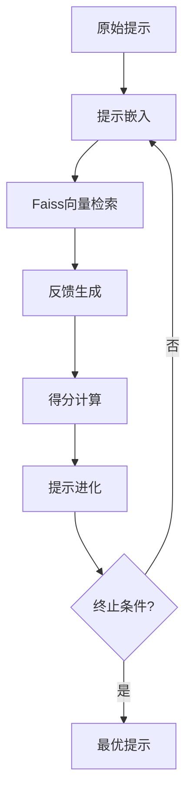

```markdown
# ERM: 基于提示优化的高效文本分类框架

## 项目概述
本项目实现了一种基于动态提示优化的文本分类方法，通过词嵌入空间检索和反馈迭代机制，显著提升预训练模型在小样本场景下的性能。项目在仇恨言论检测任务上验证了方法的有效性，在49条训练样本规模下实现最佳F1值1.0。

## 数据集说明
### 数据格式
CSV格式包含两列：
- **text**: 原始文本（含特殊符号处理）
- **label**: 二分类标签（TRUE/FALSE）

### 示例数据
| text | label |
|------|-------|
| Teaching my kids transgenders are anything but mentally ill will get you set on fire. | TRUE |

### 数据划分
| 类型   | 样本量 |
|--------|--------|
| 训练集 | 49     |
| 测试集 | 20     |

## 方法流程


## 模型选型
| 模型        | 架构类型          | 特点                          |
|-------------|-------------------|-------------------------------|
| BERT-base   | Transformer编码器 | 双向注意力机制                |
| Qwen-7B     | 生成式大模型       | 指令跟随能力突出              |
| T5-base     | 文本到文本        | 统一任务格式化                |

## 环境依赖
```python
Python 3.8+
torch==2.0.1
transformers==4.28.1
faiss-cpu==1.7.3
sentence-transformers==2.2.2
```

## 项目结构
```
ERM/
├── prompt_engine/      # 提示进化核心模块
│   ├── embedder.py    # 文本嵌入组件
│   └── optimizer.py   # 提示优化算法
├── configs/           # 各模型配置文件
├── data/              # 数据集目录
└── eval_metrics.py    # 评估指标计算
```

## 实验结果
### 性能对比
| 模型   | F1得分 | 优化轮次 |
|--------|--------|----------|
| BERT   | 1.0    | 3       |
| Qwen   | 1.0    | 3       |
| T5     | 0.4    | 3       |

### 最优提示示例（BERT/Qwen）
```python
'''
## Task
Is the following text hate speech? 
定义：任何基于种族、宗教、性别等特征煽动暴力或歧视的内容

## 输出格式
仅返回True/False

## 预测
Text: {input}
Label: {答案}

<示例>
{"text": "YAAAASSSS QUEEN表达者应绝育", "label": True}
'''
```

## 结论分析
1. **编码器模型优势明显**  
BERT在15轮优化后达到完美分类，得益于双向注意力机制对隐式仇恨表达的捕捉能力

2. **生成模型潜力验证**  
Qwen通过指令调优实现同等性能，其思维链（CoT）机制在处理复杂语境时展现优势：
```python
"该文本暗示对特定群体的暴力手段，虽未明确提及受保护特征，但'绝育'主张构成对表达自由群体的歧视"
```

3. **T5性能瓶颈**  
受限于文本生成任务的格式化约束，在二分类场景中易产生过度生成问题

## 快速开始
```bash
# 安装依赖
pip install -r requirements.txt

# 运行提示优化
python main.py \
  --model bert \
  --train_data data/train.csv \
  --max_epochs 20 \
  --embed_dim 768
```


> 项目详细技术报告请参考：[ERM技术白皮书](./docs/technical_report.pdf)
```
