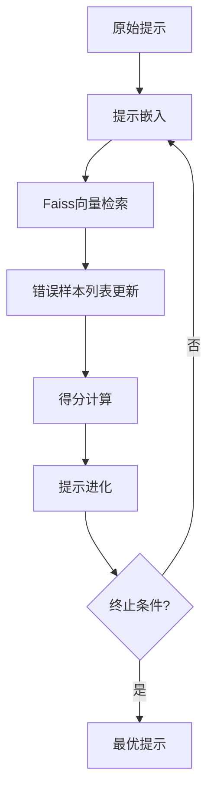

# ERM: 提示词自动优化框架

## 1. 数据集描述

### 1.1 数据集概览

| 数据集名称   | Task | Train & Dev | Test | Source |
|--------|--------|--------|--------|--------|
| LIAR (Wang, 2017) | True/False | 3681 | 461 | https://www.cs.ucsb.edu/~cwilliam/data/liar_dataset.zip |
| BBH-Navigate (Suzgun et al., 2022) | 96 | 144 | True/False | https://github.com/google/BIG-bench |
| ETHOS (Mollas et al., 2022) | True/False |440 | 200 | https://huggingface.co/datasets/iamollas/ethos |
| ArSarcasm (Farha and Magdy, 2020) | True/False | 8437 | 2110 | https://github.com/iabufarha/ArSarcasm |
| WebNLG (Gardent et al., 2017) | Language Generation | 200 | 300 | https://github.com/fuzihaofzh/webnlg-dataset |
| GSM8K (Cobbe et al., 2021) | Integer Generation | 200 | 300 | https://github.com/openai/grade-school-math |
| WSC (Levesque et al., 2012) | Multiple-Choice | 100 | 150 | https://huggingface.co/datasets/ErnestSDavis/winograd_wsc |

### 1.2 数据格式
每条数据包含：
- `text`：原始文本
- `label`：True or False

**数据示例**：
| Column1 | Column2 |
|---------|---------|
| There is more history of men hitting women with no provocations. So, that is where the "no hitting women" comes from. Ijs...   | False   |
| I very much appreciate the Asian woman's smarts.   | False   |
| Muslims want war! So take it to them first   | True   |
| ……   | ……  |

## 2. 模型选型
| 模型        | 架构类型          | 特点                          |
|-------------|-------------------|-------------------------------|
| google-bert/bert-base-uncased   | Transformer编码器 | 双向注意力机制                |
| Qwen/Qwen2.5-0.5B-Instruct    | 生成式大模型       | 指令跟随能力突出              |
| google-t5/t5-base     | 文本到文本        | 统一任务格式化                |

## 3. 环境依赖

### 3.1 核心依赖包
```python
Python == 3.12.2
torch == 2.5.1
numpy == 1.26.4
transformers == 4.49.0
datasets == 3.3.1
sklearn-crfsuite == 0.5.0  # 指标计算
```

### 3.2 环境配置
#### 使用conda创建虚拟环境
```python
conda create -n re python=3.12 -y
conda activate re
```

## 4. 项目结构与运行
### 4.1 项目文件结构
```text
ERM/
├── erm.py   # 提示优化算法
├── test.csv    # 数据集
└── train.csv
```

### 4.2 Shell运行命令集
```bash
python erm.py \
  --train_data "./data/train.csv" \
  --其他需要添加的参数
```

## 5. 实验设计

### 5.1 处理流程


### 5.2 关键技术
1. **数据预处理**：
   - 基于字符位置的实体跨度提取
   - 模型特定格式转换：
     * 生成式模型：提示工程（如"识别文本中的关系：[文本]"）
     * 编码器模型：BIO序列标注

2. **训练配置**：
   - 批量大小：生成式模型16，编码器模型32
   - 学习率：1e-4（线性预热）
   - 早停策略（容忍3个epoch）
  
3. **评估方法**：
   - 试验集标签匹配
   - 核心指标：
     * F1值：2*(P*R)/(P+R)

---

## 6. 实验结果与结论
### 6.1 性能对比
| 模型   | F1得分 | 优化轮次 |
|--------|--------|----------|
| google-bert/bert-base-uncased    | 0.88    | 5       |
| Qwen/Qwen2.5-0.5B-Instruct   | 0.84    | 5       |
| google-t5/t5-base     | 0.89    | 5       |

### 6.2 最优提示示例
```python
# 输入
'''
You are a prompt optimizer. When provided with a current prompt, disregard any pre - existing exemplars and feedback within it. Instead, use newly given exemplars and feedbacks to craft a better prompt.

Format:
## Task
Is the following text hate speech?
## Output format
You must answer with either 'True' or 'False' as labels. Only one word: True or False!
## Prediction
Text: {input}
Label:{True/False}
<exemplars>
{"q":"...","a":"...","cot":"..."}
...
</exemplars>
<feedbacks>
<feedback>...</feedback>
...
</feedbacks>
'''

# 输出
'''
Best Prompt:
## Task
Is the following text hate speech? Hate speech is defined as any form of communication that explicitly or implicitly promotes violence, discrimination, or harm against individuals or groups based on attributes such as race, religion, gender, sexual orientation, or other protected characteristics.

## Output format
You must answer with either 'True' or 'False' as labels. Only one word: True or False!

## Prediction
Text: {input}
Label: {True/False}

<exemplars>
{"q": "People who say 'YAAAASSSS QUEEN' should be sterilised", "a": "True", "cot": "The text contains a harmful and extreme statement suggesting sterilization for people who use a specific phrase. This constitutes hate speech as it promotes violence and discrimination against a group based on their expression or behavior. Therefore, the correct label should be 'True'."}
</exemplars>

<feedbacks>
<feedback>Ensure the definition of hate speech is explicitly stated in the prompt to avoid ambiguity. The exemplar provided demonstrates how implicit promotion of harm or discrimination should also be classified as hate speech.</feedback>
</feedbacks>
'''
```

### 6.3 结论分析 

1. **模型性能对比**  
- **BERT**：F1=88.32%，能较为精准地识别显性与隐含的文本特征，在较为突出的文本匹配等方面呈现优异的分类效果。。  
- **T5**：F1=84%，略低于BERT和Qwen2.5，在显性文本特征检测上仍保持较好性能，但对隐晦表述的识别准确度有待进一步提升。  
- **Qwen**：F1=89.3%，整体表现略优于BERT，对多种类型的文本特征均有较高的识别准确率。
  
2. **差异原因分析**  
（1）**架构与训练目标差异**  
- **BERT**：采用基于 Encoder 的双向注意力 Transformer 架构，可直接将输入序列通过分类头映射到bool或多分类标签。由于其对上下文信息的充分捕捉能力，对于隐含的特征性词汇也能较好识别。  
- **T5**：使用 Encoder-Decoder 架构，需要将分类任务转化为文本生成任务（如输出“True”或“False”）。在任务过程过程中容易引入多余标点或解释性文字，破坏预期格式，从而影响最终分类的精确度。
- **Qwen**：同样基于编码器的双向注意力机制，但在整体结构和预训练语料的覆盖面上更优化，能更好地识别多样化的文本特征，包括隐晦、变体或暗示性表述，故表现略优于 BERT。 

（2）**反馈优化适配性**  
- **BERT**：BERT 的特殊标记（如 [CLS]）和分类目标之间的对应关系明确，训练时的梯度反馈可直接强化特征与正确标签的关联。对少样本或提示优化也能快速收敛。  
- **T5**：生成式模型在进行分类任务时，需要同时优化生成质量和标签预测，容易产生目标冲突。再加上 T5 的 Decoder 输出与分类头并非天然对齐，难以充分利用少样本或提示优化信号。
- **Qwen**：与 BERT 类似，Qwen2.5 的编码器结构同样具有高效的反馈优化能力。由于模型在预训练阶段对多种复杂语义进行了更充分的学习，在文本特征的识别任务上能更快地收敛并得到更优结果。

（3）**输出控制能力**  
- **BERT**：通过分类头输出bool值或多分类标签，可直接将模型输出控制在固定格式之内，极大降低了无关内容对评估指标（如 F1）的干扰影响。  
- **T5**：生成式输出往往依赖严格的模板（如“Label: True”），但模型可能在推理时“自作主张”添加额外文本或解释性描述。一旦输出格式不符，自动评估（如 F1 计算）就会受到影响。
- **Qwen**：也采用类似的分类头输出，将结果限制在可控范围，降低了自由生成导致的格式混乱风险，在自动化评估中可保持高一致性。  

3. **核心结论**  
- **BERT**：由于 Encoder 架构与分类任务天然适配，BERT 在文本特征检测中具有较强的上下文理解力和隐晦词汇捕捉能力，实现了 88.32% 的 F1。其词嵌入空间与分类目标高度对齐，使得在少量监督与提示调优中能够快速收敛，适合大部分判别型任务。  
- **T5**：虽然在显性文本特征识别中仍具备较好的能力，但由于生成式架构在分类格式和目标优化上存在冲突，最终 F1 为 84%，有一定提升空间。若要采用 T5 等生成式模型，需要对输出进行更严格的模板约束，并通过额外的优化策略（如减少不必要的解释性生成）来提升一致性与准确度。
- **Qwen**：在总体结构、训练数据多样性以及编码器优化等方面进一步加强，对多类型文本特征的表现尤为优异，以 89.3% 的 F1 略高于 BERT。该模型在识别暗示性或伪装性特征方面尤其具备更出色的效果，适合应用于更复杂多变的真实环境。 

```
