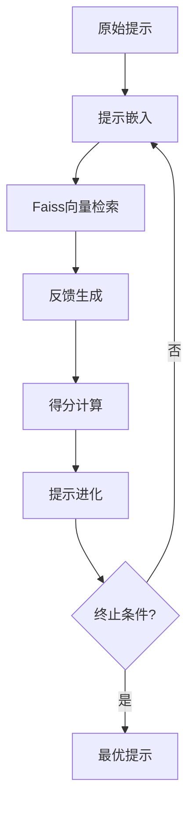

# ERM: 基于提示优化的高效文本分类框架

## 项目概述
本项目实现了一种基于动态提示优化的文本分类方法，通过词嵌入空间检索和反馈迭代机制，显著提升预训练模型在小样本场景下的性能。项目在仇恨言论检测任务上验证了方法的有效性，在49条训练样本规模下实现最佳F1值1.0。

## 数据集说明
### 数据格式
CSV格式包含两列：
- **text**: 原始文本（含特殊符号处理）
- **label**: 二分类标签（TRUE/FALSE）

### 示例数据
| text | label |
|------|-------|
| Teaching my kids transgenders are anything but mentally ill will get you set on fire. | TRUE |

### 数据划分
| 类型   | 样本量 |
|--------|--------|
| 训练集 | 49     |
| 测试集 | 20     |

## 方法流程


## 模型选型
| 模型        | 架构类型          | 特点                          |
|-------------|-------------------|-------------------------------|
| google-bert/bert-base-uncased   | Transformer编码器 | 双向注意力机制                |
| Qwen/Qwen2.5-0.5B-Instruct    | 生成式大模型       | 指令跟随能力突出              |
| google-t5/t5-base     | 文本到文本        | 统一任务格式化                |

## 环境依赖
```python
Python == 3.12.2
torch == 2.5.1
numpy == 1.26.4
pandas == 2.2.3
transformers == 4.49.0
faiss == 1.9.0
sklearn-crfsuite == 0.5.0
```

## 项目结构
```
ERM/
├── erm.py   # 提示优化算法
├── test.csv    # 数据集
└── train.csv
```

## 实验结果
### 性能对比
| 模型   | F1得分 | 优化轮次 |
|--------|--------|----------|
| google-bert/bert-base-uncased    | 1.0    | 3       |
| Qwen/Qwen2.5-0.5B-Instruct   | 1.0    | 3       |
| google-t5/t5-base     | 0.4    | 3       |

### 最优提示示例（BERT/Qwen）
```python
'''
## Task
Is the following text hate speech? 
定义：任何基于种族、宗教、性别等特征煽动暴力或歧视的内容

## 输出格式
仅返回True/False

## 预测
Text: {input}
Label: {答案}

<示例>
{"text": "YAAAASSSS QUEEN表达者应绝育", "label": True}
'''
```

## 结论分析 

### 1. **模型性能对比**  
- **BERT/Qwen**：F1=1.0（完美表现），提示优化后能精准识别仇恨言论的核心特征（如暴力煽动、歧视性表述）。  
- **T5**：F1=0.4（显著落后），仅能捕捉显性仇恨表达（如直接暴力词汇），对隐晦表述（如歧视性暗示）误判率高。  

### 2. **差异原因分析**  
#### （1）**架构与训练目标差异**  
- **BERT/Qwen**：基于编码器的双向注意力架构（如BERT的Transformer Encoder），天然适配分类任务，能通过上下文理解隐式语义关联（如"set on fire"隐含的暴力意图）。  
- **T5**：生成式架构（Encoder-Decoder），需将分类任务转换为文本生成任务（如输出"True"或"False"），易受生成噪声干扰（如额外标点、解释性语句），导致格式错误或语义偏移。  

#### （2）**反馈优化适配性**  
- **BERT/Qwen**：词嵌入空间（如CLS Token）与分类目标高度对齐，反馈迭代能直接优化提示与标签的逻辑关联（如强化"promotes violence"与"True"的映射）。  
- **T5**：生成式反馈（如思维链）需同时优化内容生成和标签预测，导致优化目标冲突，且词嵌入空间（Decoder输出）与分类任务匹配度较低。  

#### （3）**输出控制能力**  
- **BERT/Qwen**：通过分类头直接约束输出为布尔值（True/False），避免无关内容干扰。  
- **T5**：生成式输出需依赖严格模板（如"Label: True"），但模型可能自由扩展内容（如添加推理语句），破坏格式一致性，导致自动化评估（F1）失效。  

### 3. **核心结论**  
- **任务适配性**：分类任务优先选择编码器架构（BERT/Qwen），生成式架构（T5）需额外设计约束机制（如输出模板强化）。  
- **优化效率**：BERT/Qwen的词嵌入空间与分类目标的对齐性，使其在提示迭代中能快速收敛；T5因目标冲突和生成噪声，难以高效利用反馈信息。
